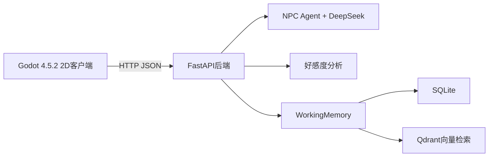

# 系统架构

```mermaid
flowchart LR
    G[Godot 4.5.2 2D客户端] -->|HTTP JSON| F[FastAPI后端]
    F --> A[NPC Agent + DeepSeek]
    F --> R[好感度分析]
    F --> M[WorkingMemory]
    M --> S[SQLite]
    M --> Q[Qdrant向量检索]
```

实验只改变 `MEMORY_MODE`：`off` 保留角色提示词、DeepSeek 回复和好感度分析，但完全关闭记忆检索与保存；`on` 启用 WorkingMemory、SQLite 和 Qdrant。
